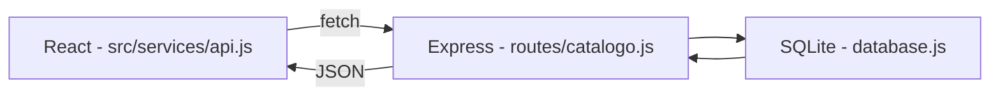

# ESCOPO.md — Catálogo de Anime/Livros

## 1. Objetivo

Projeto de preparação para as aulas de Node.js + React (com Vite) do curso de ADS.
Foco: fixar fundamentos de back-end (API REST) e front-end (componentes, hooks,
consumo de API), com um tema pessoal para tornar a prática mais engajante.

**Não é** um projeto de portfólio para recrutadores neste momento — é um projeto de
estudo estruturado, mas documentado com o mesmo rigor dos projetos de portfólio.

## 2. Escopo funcional

CRUD completo de um catálogo pessoal de animes e livros:

- Listar todos os itens do catálogo
- Adicionar um novo item
- Editar um item existente (status, nota, comentário)
- Remover um item
- Filtrar por tipo (anime / livro) e por status

## 3. Modelo de dados

Tabela única `catalogo`:

| Campo        | Tipo                                               | Obrigatório | Observação                  |
| ------------ | -------------------------------------------------- | ----------- | --------------------------- |
| `id`         | INTEGER (auto increment, PK)                       | sim (auto)  | Identificador único         |
| `titulo`     | TEXT                                               | sim         | Nome do anime/livro         |
| `tipo`       | TEXT (`anime` \| `livro`)                          | sim         | Categoria                   |
| `status`     | TEXT (`quero_ver` \| `em_andamento` \| `completo`) | sim         | Estado atual                |
| `nota`       | INTEGER (1–5)                                      | não         | Avaliação pessoal           |
| `comentario` | TEXT                                               | não         | Observações livres          |
| `criado_em`  | DATETIME (auto)                                    | sim (auto)  | Data de criação do registro |

## 4. Stack técnica

| Camada      | Tecnologia                    | Motivo                                                         |
| ----------- | ----------------------------- | -------------------------------------------------------------- |
| Back-end    | Node.js + Express             | Exigência da disciplina; API REST simples e amplamente usada   |
| Banco       | SQLite (via `better-sqlite3`) | Zero configuração de servidor; SQL de verdade; ideal p/ estudo |
| Front-end   | React + Vite                  | Exigência da disciplina (professor usa Vite)                   |
| Comunicação | REST (JSON) via `fetch`       | Padrão mais comum em entrevistas e no mercado                  |
| CORS        | pacote `cors` no Express      | Front (porta 5173) e back (porta 3000) rodam separados         |

## 5. Estrutura de pastas planejada

```
catalogo-anime-livros/
├── ESCOPO.md
├── README.md
├── backend/
│   ├── package.json
│   ├── server.js
│   ├── db/
│   │   └── database.js       # conexão + criação da tabela
│   └── routes/
│       └── catalogo.js       # rotas REST (GET, POST, PUT, DELETE)
└── frontend/
    ├── package.json
    ├── vite.config.js
    └── src/
        ├── App.jsx
        ├── components/
        │   ├── ListaCatalogo.jsx
        │   ├── FormularioItem.jsx
        │   └── FiltroTipo.jsx
        └── services/
            └── api.js         # funções de fetch para a API
```

## 6. Rotas da API (planejadas)

| Método | Rota            | Ação                 |
| ------ | --------------- | -------------------- |
| GET    | `/catalogo`     | Lista todos os itens |
| GET    | `/catalogo/:id` | Detalha um item      |
| POST   | `/catalogo`     | Cria um item         |
| PUT    | `/catalogo/:id` | Edita um item        |
| DELETE | `/catalogo/:id` | Remove um item       |

## 7. Fluxo de dados (visão geral)



## 8. Roteiro de execução (passo a passo, para quando começar)

1. ✅ Planejar o modelo de dados
2. ✅ Criar o back-end com Node + Express (rotas CRUD completas: GET, GET/:id, POST, PUT, DELETE — testadas via Thunder Client, com tratamento de erro 404)
3. ⏸️ Conectar o SQLite — **adiado por decisão consciente** (ver seção 11)
4. ✅ Testar todas as rotas isoladamente via Thunder Client (feito no passo 2, junto com a criação de cada rota)
5. ✅ Criar o front-end com `npm create vite@latest frontend -- --template react` (linter: ESLint)
6. ✅ Configurar **React Router** (`react-router-dom`): `BrowserRouter` no `main.jsx`, `Routes`/`Route`/`Link` no `App.jsx`, páginas `ListaCatalogo` e `NovoItem` navegáveis sem reload, F5 funcionando em qualquer rota
7. ✅ Construir os componentes de conteúdo inicial: `ListaCatalogo` (lista com `.map()`) e `NovoItem` (formulário controlado com `useState`)
8. ✅ Conectar o React à API via `fetch`: listagem via `useEffect` (GET) e criação via `handleSubmit` (POST), com reset do formulário após salvar
9. ✅ Configurar CORS no Express (feito no passo 2)
10. ⬜ Revisão final + ajustes de UX (loading, mensagens de erro, evitar duplicidade de POST em cliques múltiplos)
11. ✅ Remover item pela interface (botão "Excluir" na lista, `DELETE` + atualização do state com `.filter()`)
12. ✅ Editar item pela interface (rota `/editar/:id`, `useParams` + `useEffect` para buscar dados existentes, `useNavigate` para redirecionar após salvar, `PUT`)
13. ⬜ Filtro por tipo/status na lista
14. ⬜ Estilização (CSS mínimo, funcional)

## 9. Fora de escopo (por enquanto)

- Autenticação/login
- Deploy em produção
- Estilização avançada (CSS mínimo, funcional)
- Testes automatizados (pode virar próxima etapa de estudo)

## 10. Status

🟢 **Back-end funcional (CRUD completo, com array em memória).**
🟢 **Front-end funcional: CRUD completo pela interface — listar, criar, editar e remover, todos conectados à API.**
🟢 **Repositório limpo: `node_modules` removido do controle de versão, `.gitignore` na raiz correta, confirmado no GitHub.**
🔵 **Próximo: filtro por tipo/status, ou estilização (CSS).**

## 11. Decisões registradas

**SQLite adiado (passo 3):** decisão consciente de pular a persistência com banco de dados
por enquanto. Motivo: o foco imediato é acompanhar o conteúdo de React/Vite que será
abordado na semana seguinte de aula, e o SQLite não é pré-requisito para isso — a estrutura
das rotas (status HTTP, `req.params`, `req.body`) permanece igual independente de onde os
dados são guardados. Efeito colateral aceito: o array em memória reseta a cada reinício do
`nodemon` (ou permanece "travado" em um estado antigo se o processo continuar rodando sem
reiniciar — já observado na prática ao testar a lista com o array vazio de uma sessão
anterior). Retomar esse passo quando o projeto for tratado como entrega "definitiva", ou
quando a disciplina abordar bancos de dados.

**React Router priorizado antes dos componentes de conteúdo:** ajuste no roteiro original
motivado por uma dificuldade real em aula — ao tentar acessar páginas diretamente (ex: via
URL ou F5), sem o roteamento configurado, as páginas não abriam. O objetivo era entender
a mecânica de rotas dentro do React de forma sólida (aplicável a qualquer projeto, não só
este), antes de preencher as páginas com conteúdo e dados reais da API. **Concluído.**

**Limpeza do repositório Git (`node_modules`):** o projeto já havia sido commitado e enviado
ao GitHub algumas vezes antes da criação do `.gitignore`, incluindo a pasta `backend/node_modules`
no histórico. Corrigido com `git rm -r --cached node_modules` (remove do controle de versão,
mantém os arquivos localmente) seguido de commit incluindo o `.gitignore`. A pasta
`frontend/node_modules` nunca chegou a ser commitada, então não precisou do mesmo tratamento.

Duas armadilhas encontradas e resolvidas no processo (registradas para referência futura):

1. A ordem importa — `.gitignore` precisa estar **commitado antes** de rodar `git add -A`,
   senão arquivos que deveriam ser ignorados (como `node_modules`) podem ser re-adicionados
   ao índice do Git sem querer, desfazendo o `git rm --cached`.
2. A **raiz real do repositório Git** é a pasta `Node + React` (onde vive a pasta `.git`),
   **um nível acima** de `catalogo-anime-livros`. Comandos Git rodados de dentro de
   `catalogo-anime-livros` funcionam normalmente (o Git busca o `.git` subindo diretórios),
   mas o `.gitignore` precisa estar fisicamente na pasta `Node + React` para ser reconhecido
   como estando "na raiz" pelo próprio Git.

**Status final: resolvido e confirmado no GitHub** — `node_modules` não aparece mais na
listagem de arquivos do repositório.

## 12. Conceitos de React já estudados

Para retomar rápido em uma próxima sessão, sem precisar reexplicar do zero:

- **Componente**: função JavaScript que retorna JSX, nome sempre com letra maiúscula
  (ex: `function ItemCatalogo() { return <div>...</div>; }`)
- **JSX**: sintaxe parecida com HTML dentro do JavaScript; para inserir valores dinâmicos,
  usa-se chaves `{ }` (ex: `<h1>Olá, {props.nome}!</h1>`)
- **Props**: forma de passar dados para dentro de um componente via atributos
  (ex: `<ItemCatalogo titulo="Jujutsu Kaisen" status="em_andamento" />`), somente leitura
- **State (`useState`)**: hook que cria uma variável "vigiada" pelo React — quando muda via
  a função `set` (ex: `setCount`), o React redesenha a tela automaticamente. Nunca se altera
  o valor diretamente (`count = count + 1` não funciona; precisa de `setCount(count + 1)`)
- **`useEffect`**: hook que executa uma ação automaticamente quando o componente aparece na
  tela; com array de dependências vazio (`[]`), roda uma única vez. Usado para buscar dados
  da API assim que a página carrega (`fetch` dentro do `useEffect`)
- **React Router**: `BrowserRouter` (envolve a aplicação, ativa o roteamento), `Routes` +
  `Route` (associam caminho de URL a um componente), `Link` (navega sem recarregar a página,
  ao contrário de `<a href>`), `useParams` (lê parâmetros dinâmicos da URL, ex: `:id` em
  `/editar/:id`), `useNavigate` (redireciona programaticamente após uma ação, ex: depois de
  salvar um formulário)
- **Formulário controlado**: cada campo tem seu valor vindo de um `state` (`value={...}`) e
  atualizado via `onChange`; múltiplos campos guardados em um objeto só, atualizados com
  spread (`setFormulario({ ...formulario, campo: novoValor })`) para não apagar os demais
- **`fetch` com POST**: requer um segundo argumento com `method`, `headers` (
  `Content-Type: application/json`) e `body` (`JSON.stringify(objeto)`); `e.preventDefault()`
  no `onSubmit` evita o reload padrão do formulário HTML
