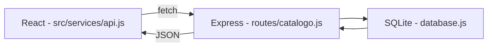

# ESCOPO.md — Catálogo de Anime/Livros

## 1. Objetivo

Projeto de preparação para as aulas de Node.js + React (com Vite) do curso de ADS.
Foco: fixar fundamentos de back-end (API REST) e front-end (componentes, hooks,
consumo de API), com um tema pessoal para tornar a prática mais engajante.

**Não é** um projeto de portfólio para recrutadores neste momento — é um projeto de
estudo estruturado, mas documentado com o mesmo rigor dos projetos de portfólio.

## 2. Escopo funcional

CRUD completo de um catálogo pessoal de animes e livros:

- Listar todos os itens do catálogo
- Adicionar um novo item
- Editar um item existente (status, nota, comentário)
- Remover um item
- Filtrar por tipo (anime / livro) e por status

## 3. Modelo de dados

Tabela única `catalogo`:

| Campo         | Tipo                                             | Obrigatório | Observação                          |
|---------------|---------------------------------------------------|-------------|--------------------------------------|
| `id`          | INTEGER (auto increment, PK)                       | sim (auto)  | Identificador único                   |
| `titulo`      | TEXT                                               | sim         | Nome do anime/livro                   |
| `tipo`        | TEXT (`anime` \| `livro`)                          | sim         | Categoria                             |
| `status`      | TEXT (`quero_ver` \| `em_andamento` \| `completo`) | sim         | Estado atual                          |
| `nota`        | INTEGER (1–5)                                      | não         | Avaliação pessoal                     |
| `comentario`  | TEXT                                               | não         | Observações livres                    |
| `criado_em`   | DATETIME (auto)                                    | sim (auto)  | Data de criação do registro           |

## 4. Stack técnica

| Camada       | Tecnologia                          | Motivo                                                        |
|--------------|--------------------------------------|-----------------------------------------------------------------|
| Back-end     | Node.js + Express                    | Exigência da disciplina; API REST simples e amplamente usada    |
| Banco        | SQLite (via `better-sqlite3`)        | Zero configuração de servidor; SQL de verdade; ideal p/ estudo  |
| Front-end    | React + Vite                         | Exigência da disciplina (professor usa Vite)                    |
| Comunicação  | REST (JSON) via `fetch`              | Padrão mais comum em entrevistas e no mercado                   |
| CORS         | pacote `cors` no Express             | Front (porta 5173) e back (porta 3000) rodam separados          |

## 5. Estrutura de pastas planejada

```
catalogo-anime-livros/
├── ESCOPO.md
├── README.md
├── backend/
│   ├── package.json
│   ├── server.js
│   ├── db/
│   │   └── database.js       # conexão + criação da tabela
│   └── routes/
│       └── catalogo.js       # rotas REST (GET, POST, PUT, DELETE)
└── frontend/
    ├── package.json
    ├── vite.config.js
    └── src/
        ├── App.jsx
        ├── components/
        │   ├── ListaCatalogo.jsx
        │   ├── FormularioItem.jsx
        │   └── FiltroTipo.jsx
        └── services/
            └── api.js         # funções de fetch para a API
```

## 6. Rotas da API (planejadas)

| Método | Rota                | Ação                          |
|--------|----------------------|--------------------------------|
| GET    | `/catalogo`          | Lista todos os itens           |
| GET    | `/catalogo/:id`      | Detalha um item                |
| POST   | `/catalogo`          | Cria um item                   |
| PUT    | `/catalogo/:id`      | Edita um item                  |
| DELETE | `/catalogo/:id`      | Remove um item                 |

## 7. Fluxo de dados (visão geral)



## 8. Roteiro de execução (passo a passo, para quando começar)

1. Planejar o modelo de dados — **feito neste documento**
2. Criar o back-end com Node + Express (rotas CRUD, sem banco ainda — array em memória)
3. Conectar o SQLite (substituir o array em memória pelas queries reais)
4. Testar todas as rotas isoladamente via Postman/Thunder Client
5. Criar o front-end com `npm create vite@latest frontend -- --template react`
6. Construir os componentes (lista, formulário, filtro)
7. Conectar o React à API via `fetch` (listar, criar, editar, excluir)
8. Configurar CORS no Express
9. Revisão final + ajustes de UX simples (loading, mensagens de erro)

## 9. Fora de escopo (por enquanto)

- Autenticação/login
- Deploy em produção
- Estilização avançada (CSS mínimo, funcional)
- Testes automatizados (pode virar próxima etapa de estudo)

## 10. Status

🟡 **Planejamento concluído — implementação não iniciada.**
Próximo passo ao retomar: item 2 do roteiro (back-end com Node + Express).
