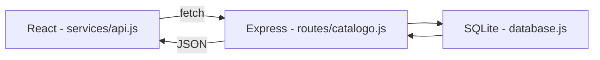

# 📚 Catálogo de Anime/Livros

Projeto de estudo full-stack (Node.js + React) construído como preparação prática
para a disciplina de back-end/front-end do curso de ADS — Senai Barueri.

> Status: 🏁 Escopo essencial concluído — CRUD completo (back-end + front-end), filtro por tipo, visual próprio aplicado
> Veja o roteiro e as decisões de progresso completas em [`ESCOPO.md`](./ESCOPO.md).

## 💡 Sobre o projeto

Um CRUD pessoal para acompanhar animes e livros: o que já assisti/li, o que estou
acompanhando, o que quero começar, com nota e comentário opcionais.

O objetivo principal não é o resultado final, e sim fixar na prática:

- Construção de uma API REST do zero (Node.js + Express)
- Persistência de dados com SQLite
- Front-end com React usando Vite (build tool exigida pela disciplina)
- Comunicação entre front e back via `fetch` (requisições HTTP + JSON)
- Fluxo completo de CRUD (Create, Read, Update, Delete) ponta a ponta

## 🛠️ Stack

| Camada      | Tecnologia                |
| ----------- | ------------------------- |
| Back-end    | Node.js, Express          |
| Banco       | SQLite (`better-sqlite3`) |
| Front-end   | React, Vite               |
| Comunicação | REST / JSON               |

## 🗂️ Estrutura

```
catalogo-anime-livros/
├── ESCOPO.md          # documento de planejamento completo
├── README.md
├── backend/            # API REST (Node + Express + SQLite)
└── frontend/           # Interface (React + Vite)
```

## 🔀 Fluxo de dados



## 📋 Rotas da API (implementadas e testadas via Thunder Client)

| Método | Rota            | Ação                                 | Status |
| ------ | --------------- | ------------------------------------ | ------ |
| GET    | `/catalogo`     | Lista todos os itens                 | ✅     |
| GET    | `/catalogo/:id` | Detalha um item (404 se não existir) | ✅     |
| POST   | `/catalogo`     | Cria um item (201)                   | ✅     |
| PUT    | `/catalogo/:id` | Edita um item (parcial)              | ✅     |
| DELETE | `/catalogo/:id` | Remove um item (204)                 | ✅     |

> Nota: persistência ainda é em array (memória) — SQLite adiado por decisão registrada
> no `ESCOPO.md` (seção 11). Dados criados via `POST` não sobrevivem a reinícios do servidor.

## 🧭 Rotas do front-end (React Router)

| Caminho       | Página                                                                                                       | Status |
| ------------- | ------------------------------------------------------------------------------------------------------------ | ------ |
| `/`           | `ListaCatalogo` — lista os itens vindos da API (GET), com ações de editar e excluir                          | ✅     |
| `/novo`       | `NovoItem` — formulário controlado que cria um item (POST)                                                   | ✅     |
| `/editar/:id` | `EditarItens` — formulário pré-preenchido com os dados do item (GET + PUT), redireciona para `/` após salvar | ✅     |

> Navegação sem reload via `<Link>`, e F5 funciona normalmente em qualquer rota
> (resolve um problema real enfrentado em aula com roteamento no React).

## ▶️ Como rodar

```bash
# back-end
cd backend
npm install
npm run dev      # sobe em http://localhost:3000

# front-end (em outro terminal)
cd frontend
npm install
npm run dev      # sobe em http://localhost:5173
```

## 🚧 Fora de escopo (por enquanto)

- Autenticação/login
- Deploy em produção
- Testes automatizados

## 📖 Documentação completa

Todas as decisões de modelagem, estrutura de pastas e roteiro de execução
passo a passo estão detalhadas em [`ESCOPO.md`](./ESCOPO.md).
